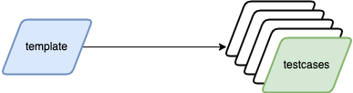
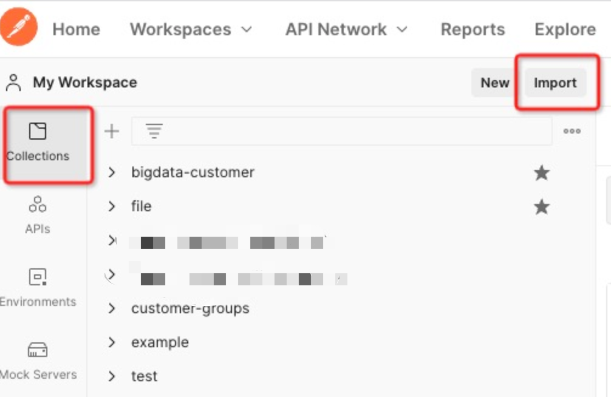
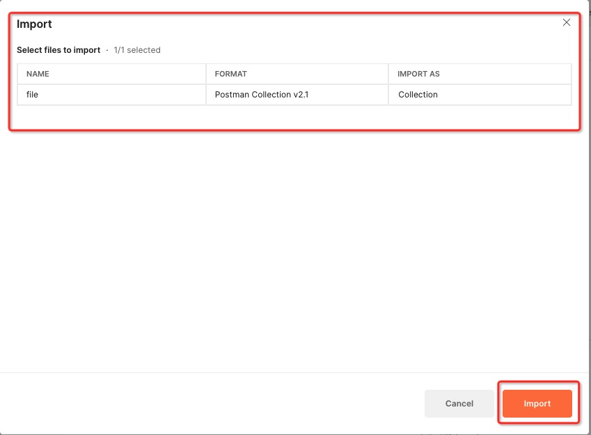
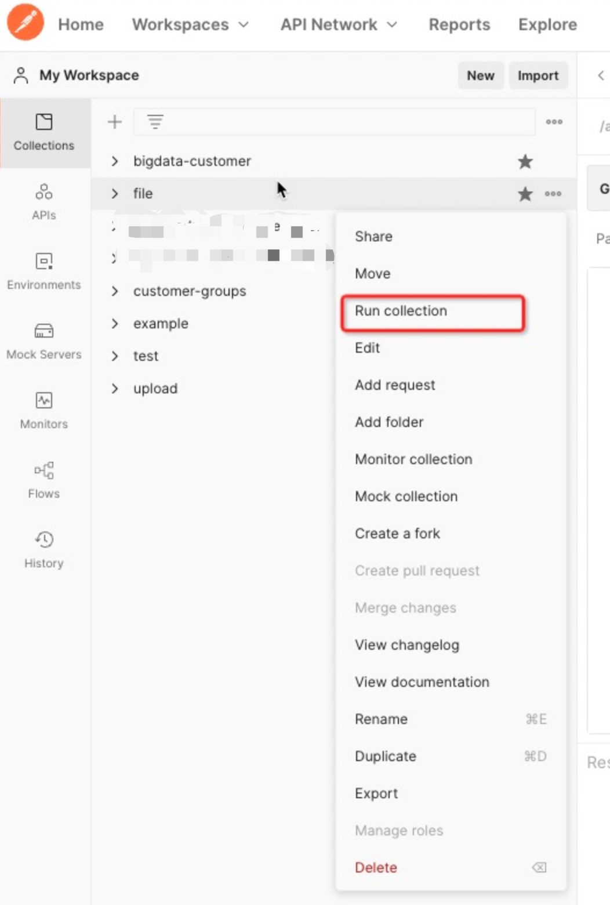
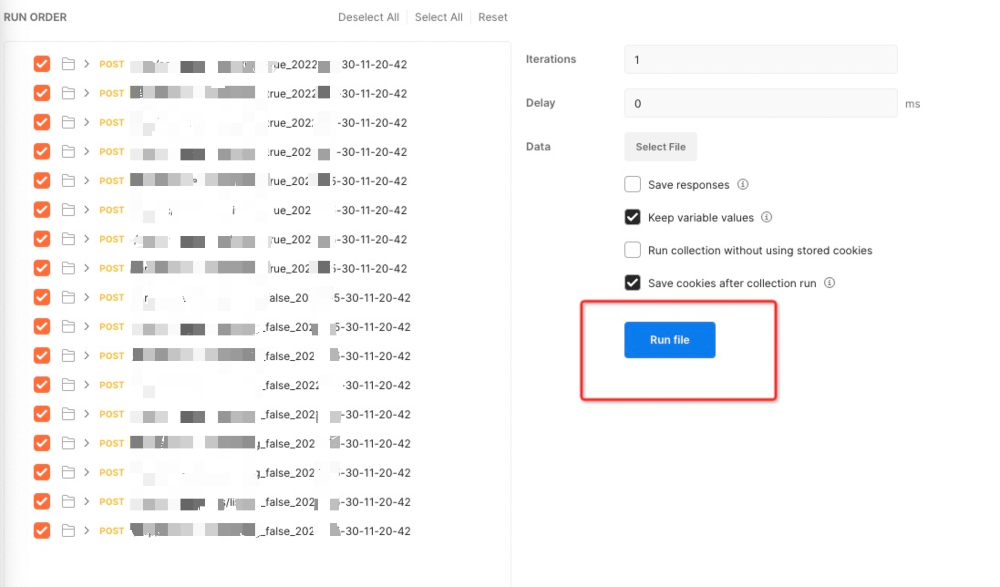

# 自动构建接口用例

## 前言

由于环境的不同，需要对所有接口进行测试时，我们无法针对某个接口做大量的维护工作。基于接口测试的必要性，我们将接口参数抽取出来，通过分散维护以及快速构建的思想。来批量构建测试用例，以期达到一个高覆盖的水准。



## 如何安装

### 环境依赖

 - python3

### 工具安装

 - 通过命令行安装

```shell
python setup.py install
```

## 模板文件语法规则

 - [用例模板语法说明](docs/explain_template.md)

## 如何使用

> 该工具以命令行的形式展现给使用者，使用者在工具安装完成后，通过命令的形式来使用工具。

### 拓展

 - [通过代码的方式进行用例拓展](docs/used_api.md)

### 工具命令

```shell
akt
```

### 命令格式

```shell
akt {case/har/eolinker} -<to> target -{f/d} file_target [-ex] [openapi] [-v]
```

### case (转换模板文件)

#### 命令

```shell
akt case
```

#### 参数说明

- **-to**：需要将模板文件转换成哪种格式的用例 {postman, eolinker}
 - **-d**：模板文件的文件夹路径

```shell
optional arguments:
  -to AK_TO, --to AK_TO {postman, eolinker} choice convert type
  -d AK_D, --d AK_D     json template files directory path
  -ex AK_EX, --ex AK_EX {openapi}
```

#### 命令示例

 - 将模板文件生成 postman 的 json 文件

```shell
akt case -to postman -d dir_name
```

### har (转换 har 文件)

#### 命令

```shell
akt har
```

#### 参数说明

 - **-to**：需要将 har 文件转换成哪种格式的文件 {postman, template}
 - **-f**：har 文件的具体路径

```shell
optional arguments:
  -to AK_TO, --to AK_TO {postman, template} choice convert type
  -f AK_F, --f AK_F     har file
```

#### 命令示例

 - 将 har 文件转换成 postman 的 json 文件

```shell
akt har -to postman -f browser.har
```

 - 将 har 文件转换成用例模板文件

```shell
akt har -to template -f browser.har
```

### postman 导入

 - 将生成好的 xxx.json 文件，通过 postman 的导入按钮添加到 postman 中



 - 确认导入的文件没有错误



#### 批量运行

 - 选择指定的集合，点击运行集合，执行集合内的所有请求。



 - 选择或者取消需要执行的用，点击 run file 按钮开始执行

